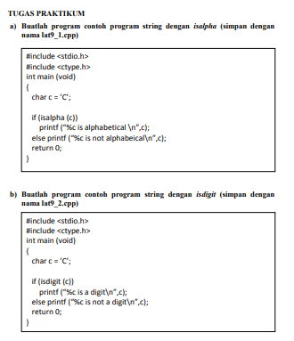
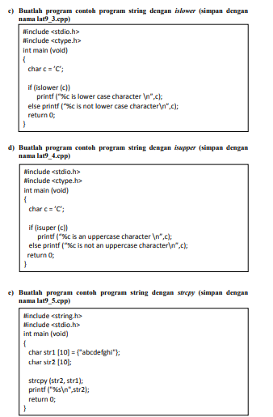
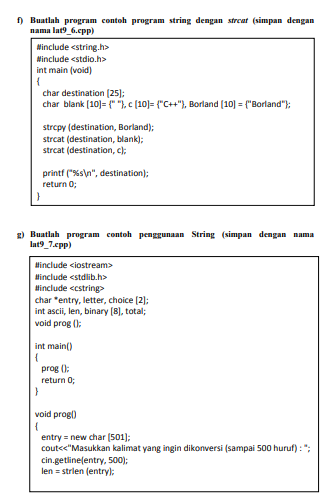
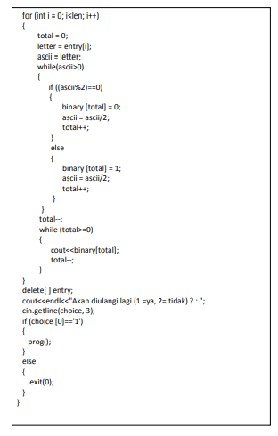

1. Jelaskan jenis-jenis fungsi String pada bahasa pemrograman C/C++!

– Strlen digunakan untuk mengetahui jumlah karakter dalam string.

– Strcat digunakan untuk menggabungkan string.

– Strcmp digunakan untuk membandingkan string dengan string lain.

– Strcpy digunakan untuk menyalin string.

– Strrev digunakan untuk membalik urutan string, misal: saya –> ayas

– Strlen digunakan untuk mengetahui panjang suatu string.

– Strcat berfungsi untuk menggabungkan 2 buah string.

– Strncat berfungsi untuk menggabungkan 2 buah string.

– Fungsi strlwr berguna untuk mengubah isi string menjadi huruf kecil.

– Fungsi strupr berguna untuk mengubah isi string menjadi kapital
